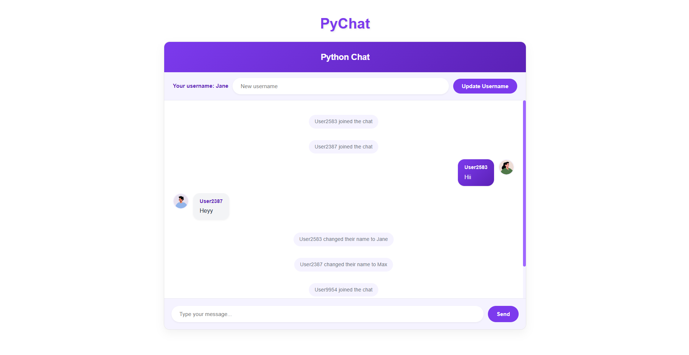

# PyChat - Real-Time Chat Application

A modern, real-time chat application built with Python Flask, Socket.IO, and vanilla JavaScript.



## Features

- 🚀 Real-time messaging
- 👤 Automatic avatar generation
- 🎨 Modern UI design
- 📱 Responsive layout
- 🔄 Username customization
- 💬 System notifications for user events
- 🎯 Message status indicators

## Prerequisites

- Python 3.7+
- pip (Python package manager)

## Installation

1. Clone the repository:
```bash
git clone https://github.com/mfakhrull/pychat.git
cd pychat
```

2. Create a virtual environment (optional but recommended):
```bash
python -m venv venv
source venv/bin/activate  # On Windows use: venv\Scripts\activate
```

3. Install dependencies:
```bash
pip install flask flask-socketio
```

## Running the Application

1. Start the server:
```bash
python app.py
```

2. Open your browser and navigate to:
```
http://localhost:5000
```

## How It Works

- The application uses Flask as the web framework
- Socket.IO enables real-time, bidirectional communication
- Random avatars are generated using avatar.iran.liara.run API
- Messages are broadcast to all connected clients
- User sessions are managed through Socket.IO connections

## Project Structure

```
pychat/
├── app.py              # Main Flask application
├── templates/
│   └── index.html      # Frontend template
└── README.md           # Project documentation
```

## Contributing

1. Fork the repository
2. Create your feature branch (`git checkout -b feature/amazing-feature`)
3. Commit your changes (`git commit -m 'Add some amazing feature'`)
4. Push to the branch (`git push origin feature/amazing-feature`)
5. Open a Pull Request

## Acknowledgments

- Flask-SocketIO for real-time communication
- avatar.iran.liara.run for avatar generation
- Socket.IO for WebSocket implementation